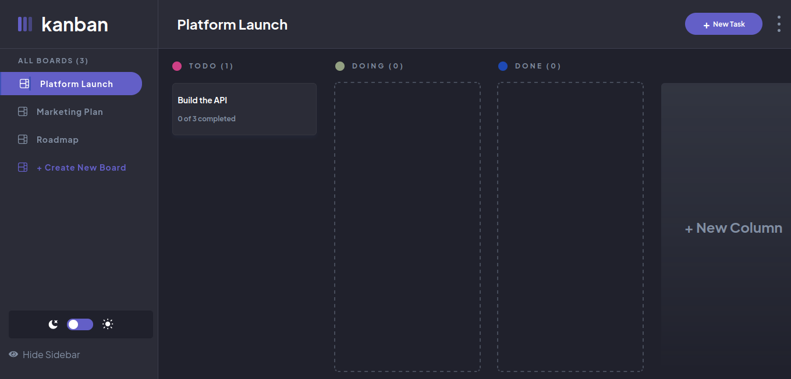
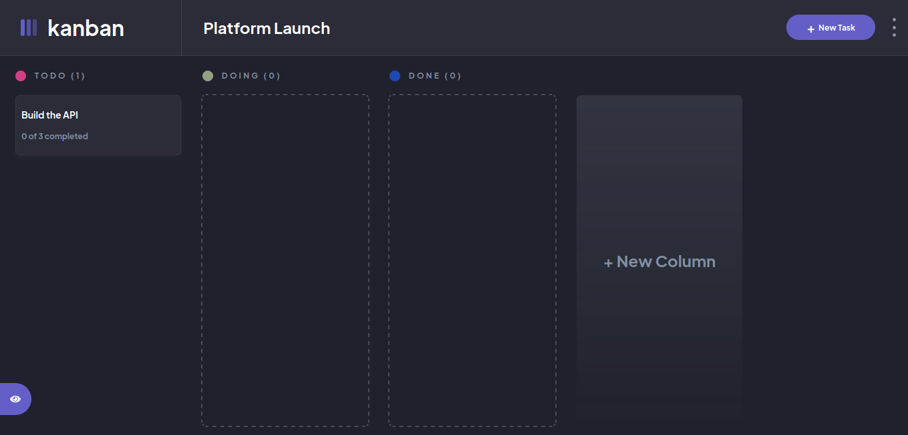

# Frontend Mentor - Kanban Task Manager

This is my solution to the Kanban Task Manager challenge on frontend mentor.

## Table of contents

- [Overview](#overview)
  - [The challenge](#the-challenge)
  - [Screenshots](#screenshots)
  - [Links](#links)
- [My process](#my-process)
  - [Built with](#built-with)
  - [What I learned](#what-i-learned)
  - [Deployment](#deployment)
  - [Useful resources](#useful-resources)
- [Author](#author)

## Overview

### The challenge

Users should be able to:

- View the optimal layout for the app depending on their device's screen size ✅
- See hover states for all interactive elements on the page ✅
- Create, read, update, and delete boards and tasks ✅
- Receive form validations when trying to create/edit boards and tasks ❌
- Mark subtasks as complete and move tasks between columns ✅
- Hide/show the board sidebar ✅
- Toggle the theme between light/dark modes ✅
- Bonus: Allow users to drag and drop tasks to change their status and re-order them in a column ❌
- Bonus: Keep track of any changes, even after refreshing the browser (localStorage could be used for this if you're not building out a full-stack app) ✅
- Bonus: Build this project as a full-stack application ❌

### Screenshots

### Links

<!-- - Live Site URL: -->

## My process

### Built with

- Flexbox
- [React](https://reactjs.org/) - JS library
- CSS modules
- TypeScript

### What I learned

- This was the most complex UI I have ever built and managing css files is quite hard.
- I now understand why people use frameworks like tailwind.

### Deployment

<!-- The app is deployed using [Vercel](https://vercel.com/) -->

### Useful resources

- [scrimba](https://www.scrimba.com) - This is in my opinion the best place to learn web development.
- [stack overflow](https://stackoverflow.com/) - Whenever I got stuck, I always found some insight here.

## Author

- Website - [Kiprop David](https://www.tanuikiprop.gq)
- Frontend Mentor - [@kiprop-dave](https://www.frontendmentor.io/profile/kiprop-dave)
